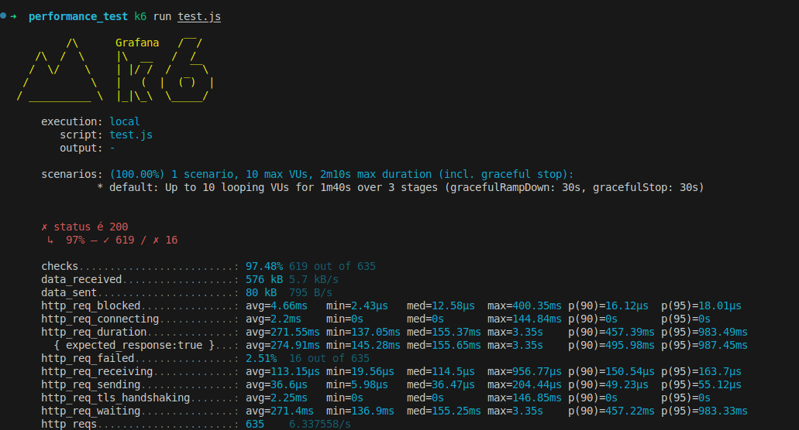

### Install linux
`sudo apt update
sudo apt install -y gnupg software-properties-common ca-certificates curl
curl -fsSL https://dl.k6.io/key.gpg | sudo gpg --dearmor -o /usr/share/keyrings/k6-archive-keyring.gpg
echo "deb [signed-by=/usr/share/keyrings/k6-archive-keyring.gpg] https://dl.k6.io/deb stable main" | sudo tee /etc/apt/sources.list.d/k6.list
sudo apt update
sudo apt install k6`

### Install Windows
`choco install k6`

### Install macOs
`brew install k6`

